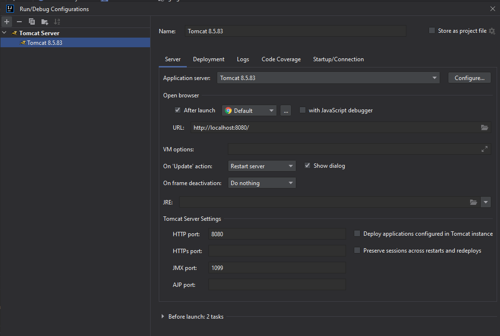

# Meme Servlet Demo

This project was made to learn about Java Servlets.

It contains a small webapp with 2 functionalities:

1. Add two numbers together.
2. Enter a number and show a meme based on that number.

Note: [web.xml](src/main/webapp/WEB-INF/web.xml) is essential to make it work. 

## Installation

To install this application you need an application server, such as TomCat. 
It should be compatible with Java 8 and Java Servlets.

Once you have an application server you need to build the project. 

You can so with the Maven command:

`mvn clean install`

This should generate a 'target' folder, which contains a `.war` file

### Deploy (with IntelliJ & Tomcat 8.5)

1. Go to `Edit Configuration` (left of where you usually press "Run").
2. Add new configuration (Plus sign +)
3. Configure application server to use local Tomcat (point it to Tomcat HOME folder)
4. Optionally you can configure it to use a different port. Default is 8080.
5. Choose an artifact to deploy (in a different tab)
6. Add a deployment
7. Choose meme-servlet-demo.war
8. Optionally you can configure the application context to a different path.
9. Run the new configuration.
10. Done!

## Usage
How to run it and showcase of functionality.
TODO: description of functionality with screenshots.

## Maintainer
[Noitcereon](https://github.com/Noitcereon)
